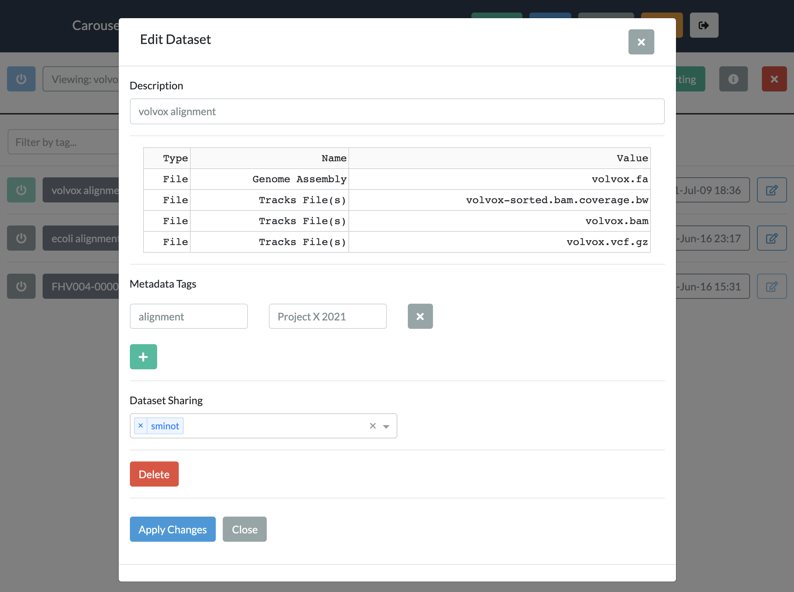

.. _using_caroursel:

Using Carousel
==============

*Carousel gives biologists point-and-click access to open source data visualization tools*

Create an account
---------------------

- In the current phase of beta testing, accounts are available `by request <mailto:hutchdatacore@fredhutch.org>`_.
- In the next phase, accounts will be made available to all Fred Hutch users.

Log In
---------

Use your Carousel username and password to securely access your account.

.. image:: _static/using_carousel/login.png
  :width: 800
  :alt: log in page

After logging in, you will see a list of the datasets which you have uploaded, or which have been
shared with you by another user.

.. image:: _static/using_carousel/main_page.png
    :width: 800
    :alt: main page of carousel

Browse the apps
--------------------

Take a look through the :ref:`apps`. page and find one which may be useful
for you and your data. 

If you have any suggestions for additional apps, please `let us know <mailto:hutchdatacore@fredhutch.org>`_.

Upload your data
----------------------

Each app in Carousel comes with a description of what files are required. For the example of JBrowse2
(below), a dataset must contain a genome assembly file (in FASTA format) as well as one or more tracks,
which may be aligned reads (in BAM format), called varients (VCF), or other continuous data (BigWig/BigBed).

To upload each of these data files, either select a file from your local computer or provide a URL from
which it can be downloaded. If your data is located in object storage (such as AWS S3) a
`presigned URL <https://docs.aws.amazon.com/AmazonS3/latest/userguide/ShareObjectPreSignedURL.html>`_
may be generated to easily import into Carousel.

.. image:: _static/using_carousel/upload.png
    :width: 800
    :alt: data upload page

After the upload is complete, the overview page shows a table confirming the list of files that were uploaded.

.. image:: _static/using_carousel/upload_2.png
    :width: 800
    :alt: upload complete

Launch your dataset
-------------------------

After uploading your dataset, you will see it appear in your list of available datasets.

.. image:: _static/using_carousel/main_page_w_new_dataset.png
    :width: 800
    :alt: main page showing the new dataset at the top

To launch the dataset, click the blue power button on the left.

.. image:: _static/using_carousel/dataset_starting_full_screen.png
    :width: 800
    :alt: main page showing the green dataset starting up badge in the top right corner

Once your dataset is running (which may take a few minutes) a blue "Dataset Running" badge will appear
near the top of the page.

Interact with your data!
-----------------------------

Once the datset is running, click on the green "Maximize" button to view the visualization.
To go back to your list of datasets, click on the "Minimize" button. To close the dataset completely, click on the
red "Close" button.

Edit and share your dataset
-------------------------------

To edit or share your dataset, click on the "Edit" icon on the right side of the dataset list. The resulting
menu provides options for:

- Sharing the dataset with specific collaborators
- Adding metadata tags to help organize your datasets
- Deleting your dataset

Metadata tags are displayed alongside your dataset on the main page. You can use the menus at the top of the page
to filter the dataset list using those tags.

Account settings
-------------------

In the Account menu, you can change the password associated with your Carousel account.

.. image:: _static/using_carousel/account.png
    :width: 800
    :alt: account password settings pop out